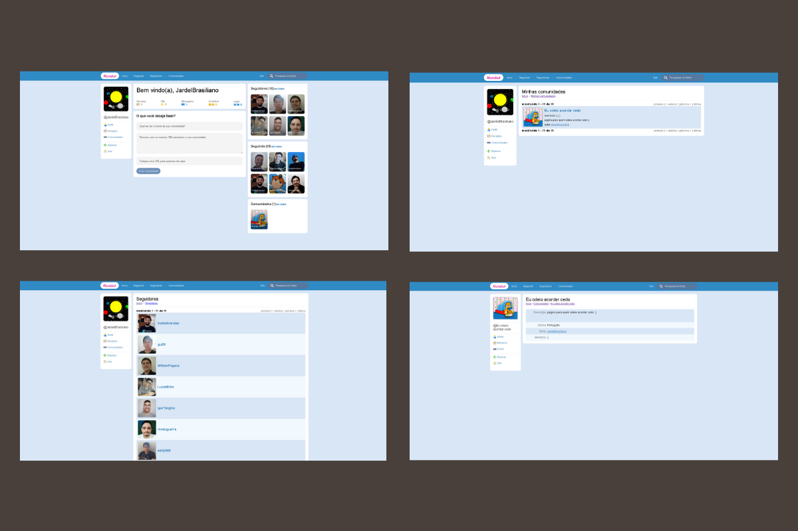

<h1 align="center">
  GitKutKut
</h1>

## 🧐 Sobre o projeto

Uma aplicação para ouvir podcasts :headphones:  

## Tecnologias 
Tecnologias utilizadas para desenvolver o projeto:
- next.js
- react.js
- styled-components

### Telas Desktop

  

## Telas e Funcionalidades

- [x] Página - Home;
  - [x] Comsumir api do gitHub para lista seguidores e seguindo.
  - [x] Com DatoCms, Criação e nova comunidade por usuario.
  - [x] Com DatoCms, Listando minha comunidades.
- [x] Página - Seguindo, Seguidores, Comunidades e Minha Comunidades:
  - [x] Listagem;
  - [ ] paginação;
- [x] Página de detalhe da comunidade:
  - [x] Informações da comunidade;
  - [x] Listagem de membros da comunidade;
